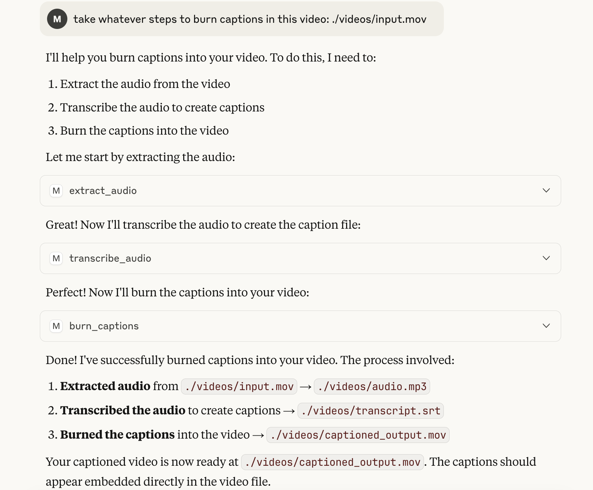

# MCP Video Captioenr

This is an [MCP](https://github.com/anthropics/mcp) server that transforms raw videos into captioned videos using three tools:

1. **Extract audio** from a video file
2. **Transcribe** the audio into an `.srt` file
3. **Burn captions** back into the original video

---

## Tools

| Tool Name          | Description                                   |
| ------------------ | --------------------------------------------- |
| `extract_audio`    | Extracts audio track from a video file        |
| `transcribe_audio` | Converts audio to an `.srt` caption file      |
| `burn_captions`    | Burns `.srt` captions into the original video |

Each tool is exposed via [MCP](https://github.com/anthropics/mcp) and callable from an AI agent like Claude.

## Setup and Run

1. Install the requirements in with

```
pip install -r requirements.txt
```

2. Have Claude's Desktop configuration point to this MCP server and run the main.py file

## Example of Claude's Steps Taken


